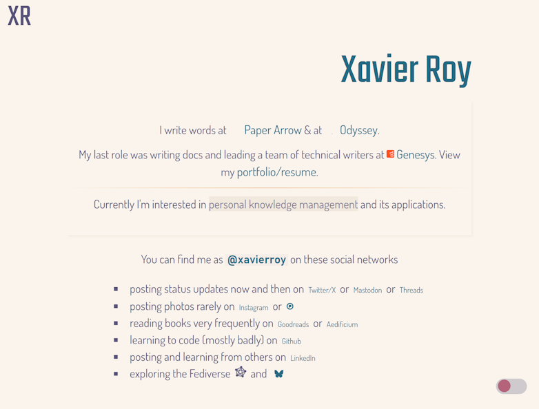

Welcome to the first post in my **Novalux** [^1] rebuild journal — a behind-the-scenes look at how I'm rebuilding my personal website, <em>xavierroy.in</em>, from the ground up.

This microsite is where I’ll share my step-by-step journey: the technical choices, [design decisions](../decision-log.md), challenges, and learnings along the way. 

My goal is to create a site that’s not just a digital business card, but a vibrant hub reflecting my professional identity, creative projects, and evolving interests.

---

### Why Rebuild?

My current site (HTML/CSS) has served me well, but over time I’ve realized it needs to evolve. I want a site that’s:

- **Modular and Maintainable**: Easy to update and extend as my work and interests grow.  
- **Modern and Fast**: Built with performant, static site technology that loads instantly.  
- **Reflective of Me**: A space that blends professionalism with personality and storytelling.

---

### Why Eleventy?

I evaluated several options:
- **[Gatsby](https://www.gatsbyjs.com/)** felt too JavaScript-heavy for a content-focused site and I do not know JavaScript
- **[Hugo](https:/gohugo.io/)**'s Go templating seemed unnecessarily complex though I love working with Hugo
- **[Next.js](https://nextjs.org/)** and **[Astro](https://astro.build/)** would be overkill for static content that I have

[Eleventy](https://11ty.dev/) emerged as the clear choice because:
- **Content-first philosophy**: Built for writers and creators, not just developers
- **Data flexibility**: Can pull content from markdown, JSON, APIs, or any data source I throw at it
- **Gentle learning curve**: I can focus on content and design without wrestling with complex tooling

The clincher was realizing I could start simple and add complexity only when needed (perfect for iterative development). And I also wanted to brush up my Eleventy skills.

**  Decision #001**: [Static Site Generator Choice](../decision-log.md#decision-001-static-site-generator-choice)
- I'll be documenting the decisions I take as I rebuild the site. 

---

### What to Expect Here?

In the posts ahead, I'll be documenting:

- How I set up the project architecture  
- Building reusable components and layouts  
- Importing and organizing content like projects, writings, and social feeds  
- Design decisions for theme, typography, and responsiveness  
- Deployment and optimization strategies  
- Lessons learned, mistakes made, and tips for others wanting to do the same

---

Whether you’re a developer, content creator, or just someone curious about the inner workings of personal websites, I hope this journal offers insight, inspiration, and maybe a few aha moments.

Thank you for joining me on this journey. Let’s get started! 

[^1]: **Novalux** combines two Latin-inspired words: *nova*, meaning “new” or “star,” and *lux*, meaning “light.”  Together, Novalux evokes the idea of a “new light” or “birth of a star,” symbolizing a fresh beginning and bright illumination. 